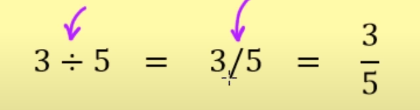

# Multiplicação e Divisão

## Multiplicação
### Regra de sinais
O produto entre dois números de sinais iguais é positivo e o produto entre dois números de sinais distintos é negativo

        +3 * (-5) = -15
        +3 *   5 = +15
        (-3) * (+5) = -15
        (-3) * (-5) = +15

### Notação
        3x5  ou 3.5 ou 3(5) ou (3)(5)

### Propriedades
- Elemento neutro
                a . 1 = a
                5 . 1 = 5

- Comutativa
                a . b = b . a
                2 . 3 = 3 . 2

- Associativa
                (a . b) . c = a . (b . c)

- Distributiva
                a(b + c) = a . b  + a . c

- Anulação
Qualquer número Multiplicado por zero é igual a zero.
                a . 0 = 0

## Divisão
### Regra de sinais
A divisão entre dois números de sinais iguais é positivo e a divisão entre dois números de sinais distintos é negativo

        +4 * (-2) = -2
        +4 *   2 = +2
        (-4) * (+2) = -2
        (-4) * (-2) = +2

### Notação

### Divisão entre números inteiros

D = divisor
d = dividendo
q = quociente
R = resto

D = d . q + R

Quando temos o R = zero, tomos uma divisão exata.
