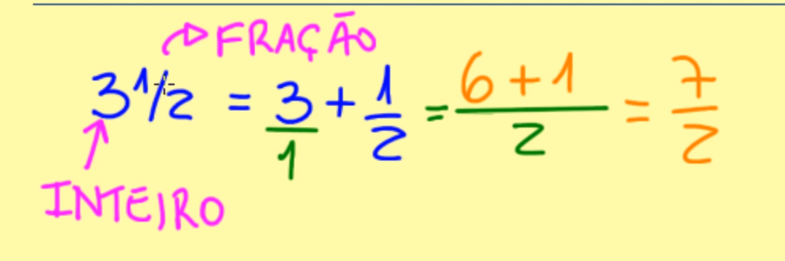
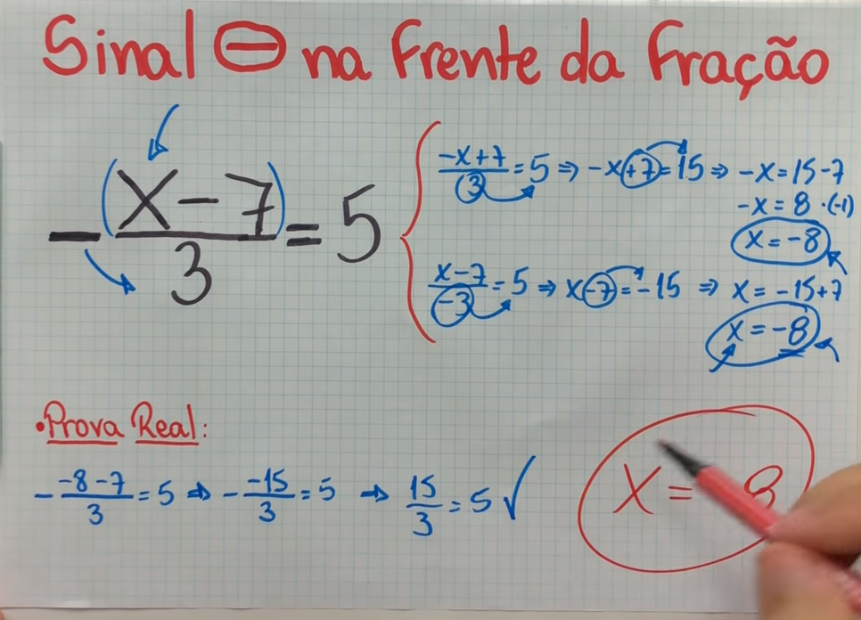

# Frações

## Frações equivalentes
Frações equivalente, são frações que representam a mesma parte do todo.

Para obtermos frações equivalentes, basta multiplicarmos o numerador e o denominador pelo mesmo número.

2/3 = 4/6

## Redução de frações a um mesmo denominador

tiramos o MMC dos denominadores

exemplo do uso do MMC para reduzir ao mesmo denominador.
 O uso de redução é interessante para que possamos fazer operações e comparações

## Comparação de fração

1. Denominadores iguais

        3/5 < 7/5

2. Denominadores diferentes

        28/35 < 30/35

## Adição e subtração de fração

1. Denominadores iguais: Conserva a base e opera sobre os numeradores

        3/5 + 6/5 - 12/5  = -3/5

2. Denominadores diferentes: reduzimos a mesma base, depois podemos conserva a base e operar sobre os numeradores

## Numero misto
Uma parte inteira mais a fracionaria

## Multiplicação de frações
Multiplicamos numerador por numerador e denominador por denominador

        3/7 * 2/4 = 6/28

Podemos simplificar alguns números

## Divisão de Frações
Multiplicamos o primeiro pelo inverso do segundo

## Sinal em frações

