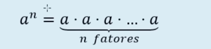
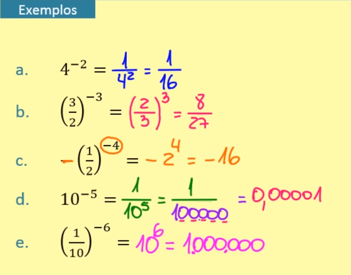
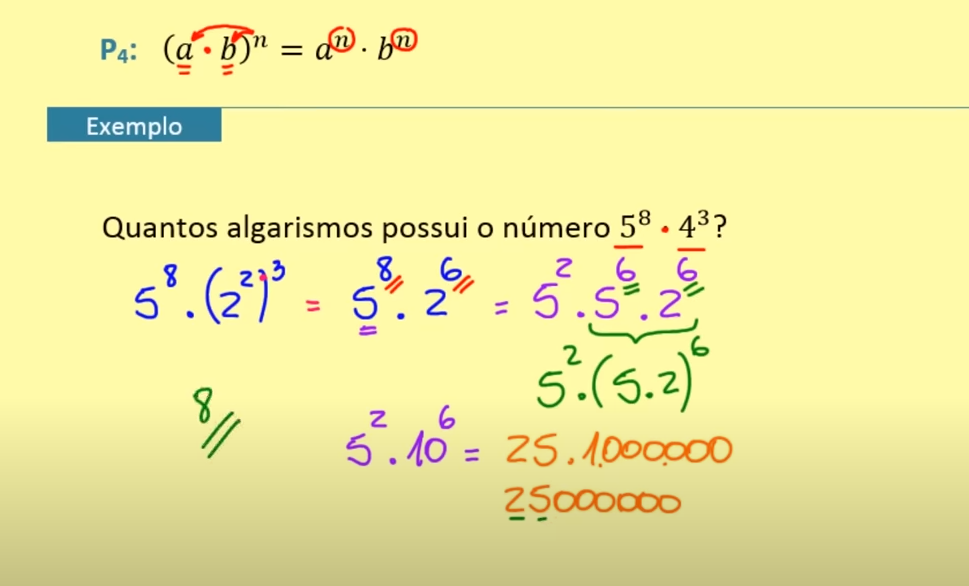
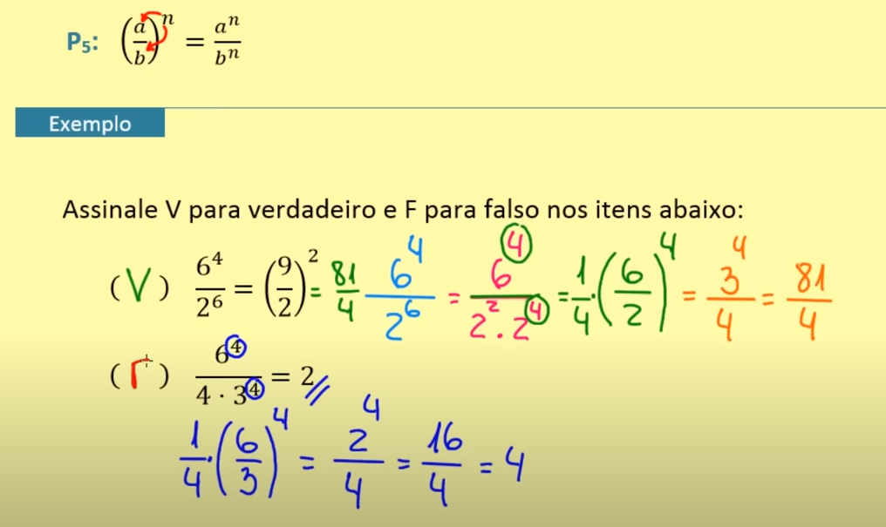

# Potenciação

Seja ***a*** um número real e ***n*** um número natural com n >= 2. A potencia de base a e expoente de n é o numero a^n tal que:

Exemplos:

Seja ***a*** um numero real não nulo e n um número natural, tal que n>=2. A potencia de base a e expoente -n é o numero a^-n tal que:

Exemplos:

Notas:
1. toda potencia de expoente 1, é igual a base

        a¹ = a
        5¹ = 5

2. para a != 0

        a⁰ = 1
        5⁰ = 1

## Propriedades

P1

P2

P3

P4

P5

