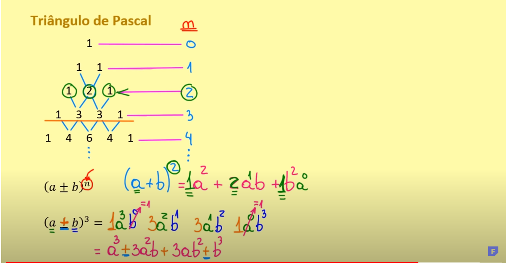

## Produtos Notáveis

São multiplicações que se destacam na matemática

## Quadrado da soma de dois termos

    (a + b)² = a² + 2ab + b²

## Quadrado da subtração de dois termos

    (a - b)² = a² - 2ab + b²

## Produto da soma pela diferença

    (a + b) . (a - b) = a² - b²

## Triangulo de Pascal

