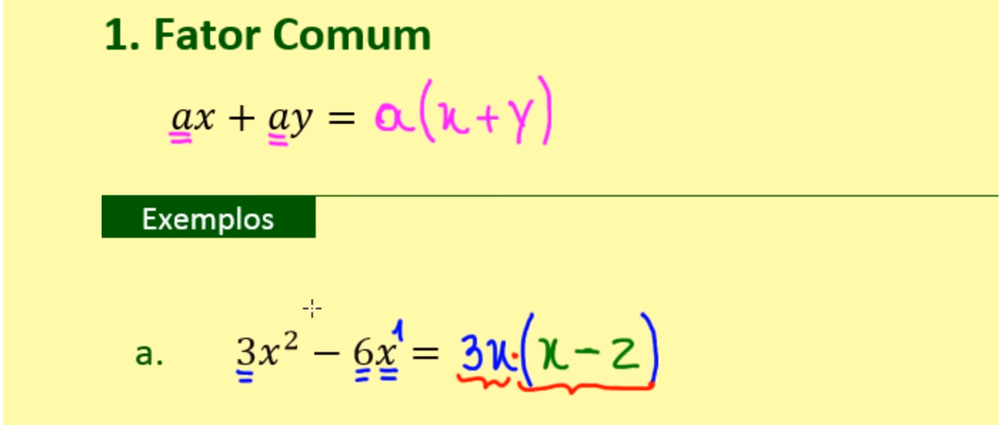
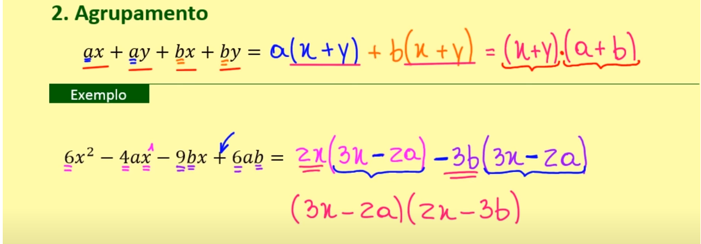
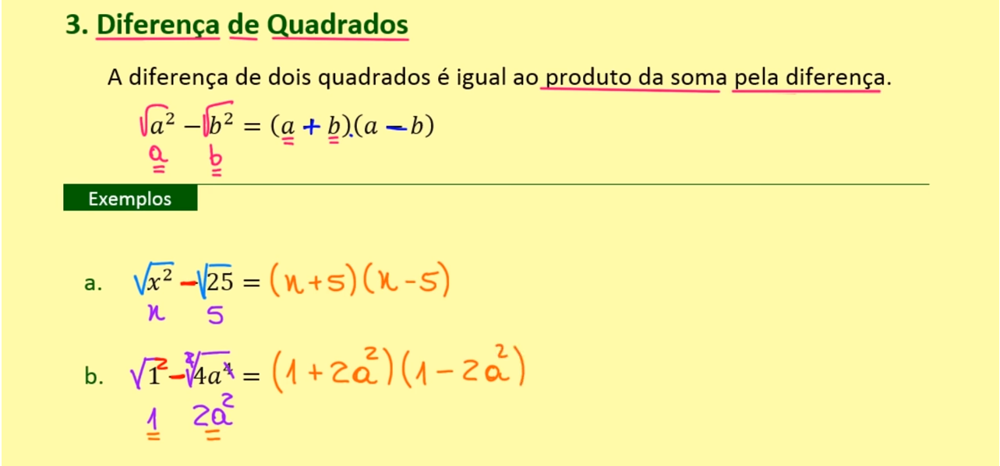
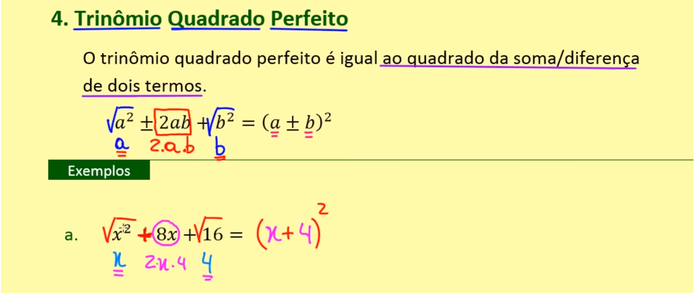
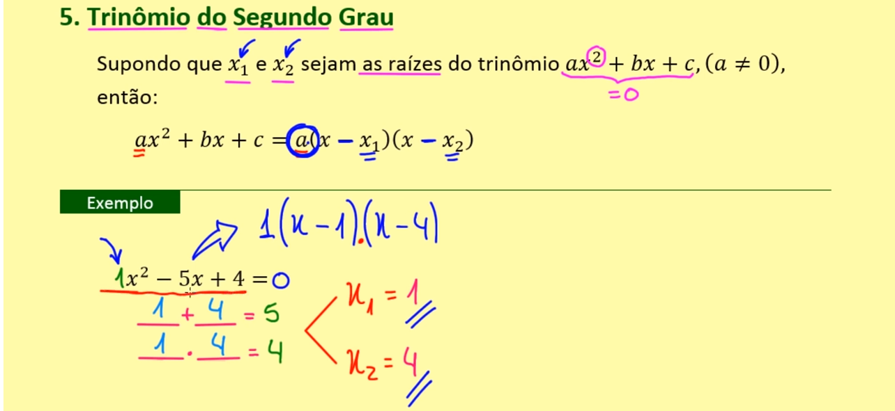

# Fatoração de expressões algébricas

Fatorar expressões algébricas é o ato de transformar uma soma ou subtração  de duas ou mais parcelas  em produtos de dois ou mais fatores.

## Fator Comum

## Agrupamento

## Diferença entre quadrados

Ambos os termos devem ser raiz perfeitas

## Trinômio Quadrado perfeito

## Trinômio do Segundo grau

\____ + \____ = -b / a

\____ . \____ =  c / a

